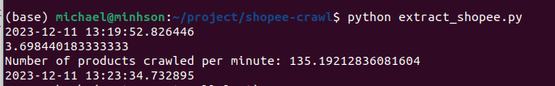
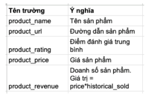
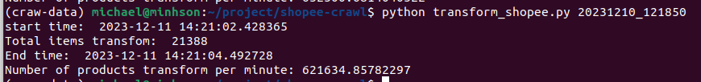
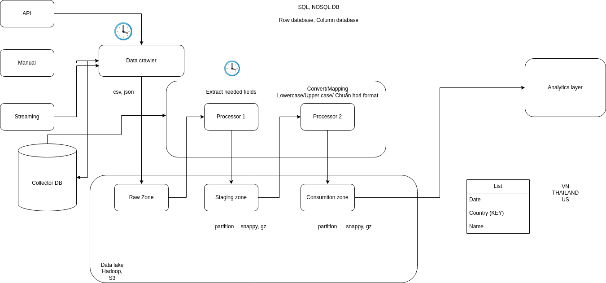

# Shopee Crawl Selenium

In this project, we collect and process data from the large e-commerce website - [shopee.vn](https://shopee.vn/)
## Installation
My device is ubuntu 22.04 and this is my setup

To create a virtual environment in the `crawl_data` folder:

```shell
python3 -m venv crawl_data
```
To activate the virtual environment

```shell
source crawl_data/bin/activate
```

Download the necessary packages in the requirements.txt file

```shell
pip3 install -r requirements.txt
```
Here is a video tutorial on installing selenium on Ubuntu and Windows that I recommend watching
- **Ubuntu:** [https://www.youtube.com/watch?v=_qd--H1jBbw](https://www.youtube.com/watch?v=_qd--H1jBbw)
- **Windows:** [https://www.youtube.com/watch?v=0oJsDVPX-LA](https://www.youtube.com/watch?v=0oJsDVPX-LA)
- **MacOS:** [https://www.youtube.com/watch?v=Urtnm6kKlGI](https://www.youtube.com/watch?v=Urtnm6kKlGI)
## Test 1: 
Crawl all products belonging to major product groups listed on the homepage of [shoppe.vn](https://shopee.vn/) (product groups as illustrated below). The goal is to get as much product as possible. Minimum requirement for each product group is 3000 products.

Evaluation criteria:
- Number of products received. (As much as possible)
- Number of products retrieved in 1 minute (The more the better)

<div align="center">
    
</div>

This is the command that runs the product extract from the website

```shell
python3 extract_shopee.py
```
After running the above command, the export folder will be created, which will store folders named after the time the command is run, and inside will be saved CSV files containing product information extracted from the product of each page

The number of products we crawl in 1 minute is a total of 135 products



## Test 2:
Transform the retrieved data into csv and excel format with the following structure:




Evaluation criteria: Number of products transformed per minute (The more the better)

This is the command that runs transform data from folder CSV

```shell
python3 transform_shopee.py {datetime folder}
Exmaple:
python3 transform_shopee.py 20231210_121850
```

Number of products transform per minute: 621635



## System Design

Below is the System Design I want to expand for this project. Because time is limited, I am still developing for this

If you are interested in this, you can contact me via gmail: minhson5921@gmail.com


